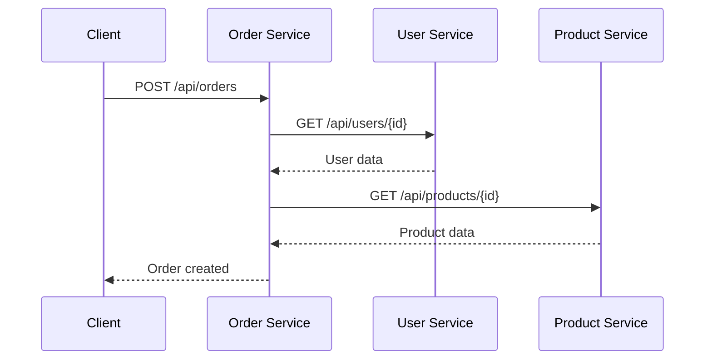
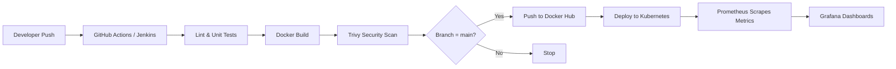

# Architecture

## System Overview

This project implements a **microservices architecture** with three independent services communicating over REST APIs. Each service is containerized, tested in CI, and deployable to Kubernetes.

## Services

| Service | Language | Port | Responsibility |
|---------|----------|------|----------------|
| **User Service** | Node.js (Express) | 3001 | User CRUD operations |
| **Product Service** | Node.js (Express) | 3002 | Product catalog management |
| **Order Service** | Python (FastAPI) | 8000 | Order creation (calls User + Product) |

## Data Flow



## CI/CD Pipeline Flow



## Component Diagram

```
┌─────────────────────────────────────────────────────────────┐
│                        GitHub Repo                          │
│  ┌─────────────┐  ┌──────────────┐  ┌─────────────────────┐ │
│  │ user-service│  │product-service│  │   order-service    │ │
│  └──────┬──────┘  └──────┬───────┘  └──────────┬──────────┘ │
└─────────┼────────────────┼─────────────────────┼────────────┘
          │                │                     │
          ▼                ▼                     ▼
┌─────────────────────────────────────────────────────────────┐
│                    CI/CD Layer                              │
│         GitHub Actions          Jenkins                     │
│    [Test → Build → Trivy → Push]                           │
└─────────────────────────┬───────────────────────────────────┘
                          ▼
┌─────────────────────────────────────────────────────────────┐
│                    Docker Hub                               │
│         user-service  product-service  order-service        │
└─────────────────────────┬───────────────────────────────────┘
                          ▼
┌─────────────────────────────────────────────────────────────┐
│              Kubernetes (Minikube / Kind)                   │
│  ┌──────────┐  ┌──────────────┐  ┌─────────────┐           │
│  │ Deployments (2 replicas each)              │           │
│  └──────────┘  └──────────────┘  └─────────────┘           │
│  ┌──────────────┐  ┌──────────────┐                        │
│  │  Prometheus  │  │   Grafana    │                        │
│  └──────────────┘  └──────────────┘                        │
└─────────────────────────────────────────────────────────────┘
```

## API Endpoints

### User Service (`/api/users`)

| Method | Path | Description |
|--------|------|-------------|
| GET | `/health` | Health check |
| GET | `/metrics` | Prometheus metrics |
| GET | `/api/users` | List all users |
| GET | `/api/users/:id` | Get user by ID |
| POST | `/api/users` | Create user |
| DELETE | `/api/users/:id` | Delete user |

### Product Service (`/api/products`)

| Method | Path | Description |
|--------|------|-------------|
| GET | `/health` | Health check |
| GET | `/metrics` | Prometheus metrics |
| GET | `/api/products` | List all products |
| GET | `/api/products/:id` | Get product by ID |
| POST | `/api/products` | Create product |
| DELETE | `/api/products/:id` | Delete product |

### Order Service (`/api/orders`)

| Method | Path | Description |
|--------|------|-------------|
| GET | `/health` | Health check |
| GET | `/metrics` | Prometheus metrics |
| GET | `/api/orders` | List all orders |
| GET | `/api/orders/:id` | Get order by ID |
| POST | `/api/orders` | Create order |

## Design Decisions

1. **Independent services** – Each service has its own repo folder, Dockerfile, tests, and CI workflow.
2. **In-memory storage** – Keeps the project simple for learning; interns can add a database later.
3. **Prometheus metrics** – Every service exposes `/metrics` for observability.
4. **Trivy in CI** – Blocks deployment of images with critical/high CVEs.
5. **Path-based CI triggers** – Only the changed service's pipeline runs.

## Draw.io Diagram

Interns should create a detailed architecture diagram using [Draw.io](https://app.diagrams.net/). A starter template description is in [`docs/diagrams/README.md`](diagrams/README.md).
